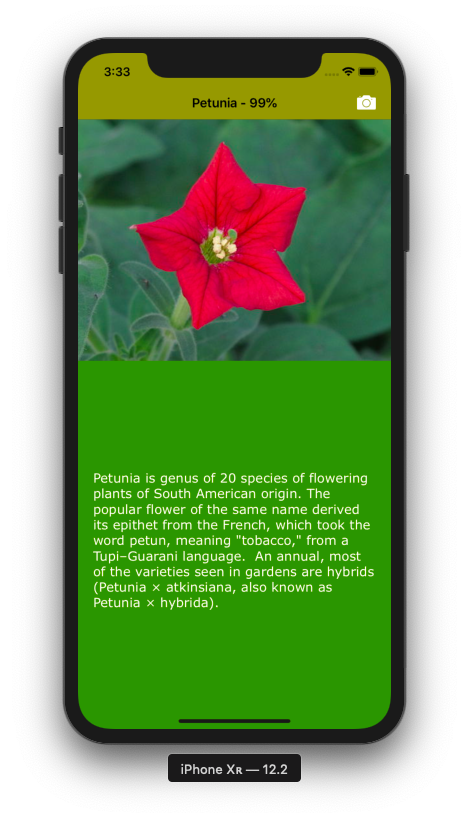

# WhatFlower

App that recognizes a flower from a picture taken by the camera, using a CoreML model. The app gives the name of the flower, the confidence percentage and the extract from Wikipedia.

